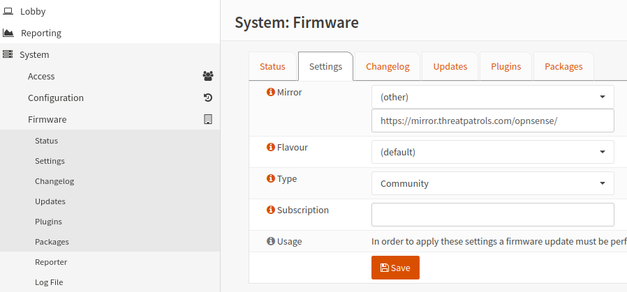

# OPNsense Mirror

## Setup

Step 1) Navigate to the Firmware settings on your OPNsense instance

* System->Firmware->Settings

Step 2) Choose `(other)` in the Mirror dropdown, and enter our mirror URL

```text
https://mirror.threatpatrols.com/opnsense/
```

## Status Monitoring
We care about the uptime and reliability of our systems and, we make it easy to monitor 
and review our performance - https://status.threatpatrols.com

## About our Mirror
Our mirror is based on a Cloudflare worker that uses object caching at Cloudflare.  This
means the first file-object request fills our Cloudflare cache from the origin, and 
subsequent requests are then served directly from a Cloudflare CDN near you.  Awesome!

## Screenshot


