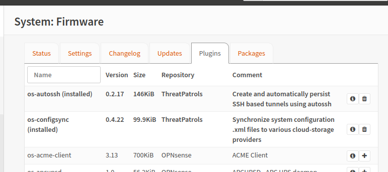

# Autossh for OPNsense

The Autossh plugin for OPNsense is a wrapper for the autossh system-package 
that allows for establishing persistent reliable SSH tunnels with remote 
hosts. It can be used to solve a wide range of connection challenges through 
the (sometimes creative) use of TCP port-forwards.

{ align=right }

Autossh tunnels can be used to quickly solve a wide range of challenges all 
over SSH, without the need for VPN clients etc:
 * Provide reverse-remote access to a site that has no public addresses, such as 
   when ISPs use NAT.
 * Ensure redundant multipath reverse-remote access via both primary and secondary 
   connections via interface binding.
 * Create your own "privacy" VPN system for local network users using a SOCKS 
   proxy (ssh-dynamic-forward) to a remote system.
 * Provide local network access to remote system services such as SMTP relays or 
   another remote TCP services.
 * Provide reverse-remote access to local network services such local RDP services.

## Installation
Installation is possible via the Threat Patrols repo.  Refer to the documentation 
for details on adding our repo to your OPNsense instance:-

 * https://documentation.threatpatrols.com/opnsense/repo

Once the Threat Patrols repo has been added to your OPNsense system you can install 
Configuration Sync directly from the OPNsense Plugins web-interface.

{ align=right }

## Source
 * https://github.com/threatpatrols/opnsense-plugin-autossh

## Copyright
* Copyright &copy; 2022 Threat Patrols Pty Ltd &lt;contact@threatpatrols.com&gt;
* Copyright &copy; 2018 Verb Networks Pty Ltd &lt;contact@verbnetworks.com&gt;
* Copyright &copy; 2018 Nicholas de Jong &lt;me@nicholasdejong.com&gt;

All rights reserved.

## License
* BSD-2-Clause - see LICENSE file for full details.

<!---
              

    <h2>Tunnel configuration</h2>
    <h3>Local Forward</h3>
    

        Describe how to expose a remote TCP port into the local network
    

    
    <h3>Remote Forward</h3>
    

        Describe how to expose a TCP port in the local network at a remote system
    

    
    <h3>Dynamic Forward</h3>
    

        Describe how to write an expression that creates a SOCKS proxy for the local network
    

    
    <h3>Gateway Ports</h3>
    

        Describe the situations where this is important and required
    

    
    <h3>Strict Host Key Checking</h3>
    

        Describe what this is all about and the interaction with the "Update Host Keys" property
    

    
    <h2>Key management</h2>
    <h3>Private Key</h3>
    

        Describe how keys are stored and the potential risks
        Describe the key types and the sometimes limited support for newer key types
    

    
    <h3>Public Key</h3>
    

        Describe how to access it
        Describe the importance of the key permission prefix to prevent abuse
        Describe where to place the public key value on the remote system
    

    
    <h3>External Keys</h3>
    

        Describe that no external keys are currently possible as a matter of preventing unwanted problem scenarios
        Willing to listen to feedback and introduce a key import feature if warranted
    

    
    <h2>Connection status</h2>
    

        Notes about forwards
        Description of status attributes
        Describe the autossh health check with a "ping" every minute
    

--->
