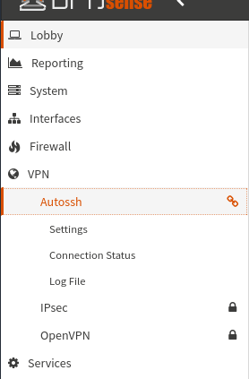
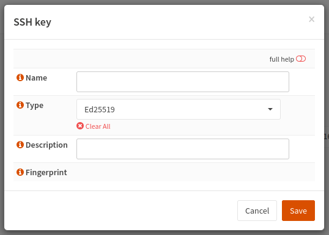

# Autossh for OPNsense

{ align=right }

The Autossh plugin for OPNsense makes it possible to create persistent and 
reliable SSH based tunnels from remote-to-local; local-to-remote; or dynamic
SOCKS5-based forward - all tunneled inside the safety and security of an 
SSH connection.

SSH port forwarding (and by extension Autossh) can be used to solve a wide 
range of connection challenges with the creative use of TCP port-forwards 
without the fussiness of setting up VPN-clients, VPN-servers - if you can 
achieve an SSH connection to your remote site then you should be able to 
create a port-forward based solution.

* Provide reverse-remote tunnel access to client-sites that have no public 
  IP address available, such as occurs with ISPs using super-NATs to provision
  customers.
* Ensure redundant multipath reverse-remote access via individual external 
  connections via ssh-tunnel interface binding.
* Create your own privacy VPN system for internal network users using a SOCKS 
  proxy (aka ssh-dynamic-forward) via a remote system.
* Easily provide local network access for just-about-any remote TCP-based service
  such as HTTP-servers, RDP desktops, SMTP relays or other SSH servers etc.
* Provide all these in reverse, allowing remote networks the same the ability to 
  access local TCP-services.

## Installation
Installation from the Threat Patrols package repository is possible using the standard
OPNsense Firmware-Plugin web-interface after the `os-threatpatrols` plugin has been added
to your system.

 - Package Repository: [opnsense/repo](/opnsense/repo/)

## Keys
{ align=right }

Before creating an SSH-tunnel you must create an SSH-key from 
the Autossh->Settings->Keys tab.

Create a key by pressing the __+__ symbol next to the rubbish-bin symbol on the bottom 
right-hand-side of the Autossh->Settings->Keys tab.

Provide a name for the key and choose a desired ssh key-type if something other 
than the default `Ed25519` is required.  Most SSH-servers deployed after 2014 should 
support `Ed25519` based ssh-keys.

The description field is a free-form text field that is not otherwise parsed.

The fingerprint value is available after generating the SSH key.

### SSH Private Key
SSH keys are created within the OPNsense system itself and stored (base64 encoded) in the 
OPNsense configuration `.xml` file.  There is no way to import user self generated SSH-key 
material.

Preventing the import of user-supplied keys is a deliberate-decision to prevent users 
mistakenly using keys that might be used for other purposes.

### SSH Public Key
{ align=right }

The SSH Public key is available by pressing the key-shaped icon under "Commands" in 
the Autossh->Settings->Keys tab.

The SSH-public key is generated with a prefix that define restrictions to prevent SSH
connections from being able to open a terminal-shell on the remote system; forward the 
ssh-agent or forward X-sessions if there is one.
```
command="",no-agent-forwarding,no-pty,no-user-rc,no-X11-forwarding
```

This means if the private-key is somehow stolen then it can not be repurposed for 
gaining shell access on the remote system.

Additionally, the SSH-public key is suffixed with the `autossh_key_id:` value that helps
identify the same key in the OPNsense system.

The entire SSH-public key value should be cut-n-paste from the OPNsense user-interface 
to the remote system `.ssh/authorized_keys` file.  It is possible for the authorized_keys 
file may have more than one value by placing individual key values on separate lines.

## Tunnels
After an SSH key is created it is possible to create an SSH-tunnel from 
the Autossh->Settings->Tunnels tab.

Create a new tunnel by pressing the __+__ symbol next to the rubbish-bin symbol on 
the bottom right-hand-side of the Autossh->Settings->Tunnels tab.

Each option provides in-line help that describes the field (press the __i__ icon). Additionally,
references to the associated `ssh_config` section are provided if more detail is
required.  Refer to the item-section in the OpenSSH manual - https://man.openbsd.org/ssh_config

__Pending: Documentation work in progress: 2022-08-20__

## Connection Status
__Pending: Documentation work in progress: 2022-08-20__

## Log File
__Pending: Documentation work in progress: 2022-08-20__

## Troubleshooting
__Pending: Documentation work in progress: 2022-08-20__

---

## Source
 * https://github.com/threatpatrols/opnsense-plugin-autossh

## Copyright
* Copyright &copy; 2022 Threat Patrols Pty Ltd &lt;contact@threatpatrols.com&gt;
* Copyright &copy; 2018 Verb Networks Pty Ltd &lt;contact@verbnetworks.com&gt;
* Copyright &copy; 2018 Nicholas de Jong &lt;me@nicholasdejong.com&gt;

All rights reserved.

## License
* BSD-2-Clause - see LICENSE file for full details.


<!---
              

    <h2>Tunnel configuration</h2>
    <h3>Local Forward</h3>
    <p>
        Describe how to expose a remote TCP port into the local network
    </p>
    
    <h3>Remote Forward</h3>
    <p>
        Describe how to expose a TCP port in the local network at a remote system
    </p>
    
    <h3>Dynamic Forward</h3>
    <p>
        Describe how to write an expression that creates a SOCKS proxy for the local network
    </p>
    
    <h3>Gateway Ports</h3>
    <p>
        Describe the situations where this is important and required
    </p>
    
    <h3>Strict Host Key Checking</h3>
    <p>
        Describe what this is all about and the interaction with the "Update Host Keys" property
    </p>
    
    <h2>Key management</h2>
    <h3>Private Key</h3>
    <p>
        Describe how keys are stored and the potential risks
        Describe the key types and the sometimes limited support for newer key types
    </p>
    
    <h3>Public Key</h3>
    <p>
        Describe how to access it
        Describe the importance of the key permission prefix to prevent abuse
        Describe where to place the public key value on the remote system
    </p>
    
    <h3>External Keys</h3>
    <p>
        Describe that no external keys are currently possible as a matter of preventing unwanted problem scenarios
        Willing to listen to feedback and introduce a key import feature if warranted
    </p>
    
    <h2>Connection status</h2>
    <p>
        Notes about forwards
        Description of status attributes
        Describe the autossh health check with a "ping" every minute
    </p>

--->
